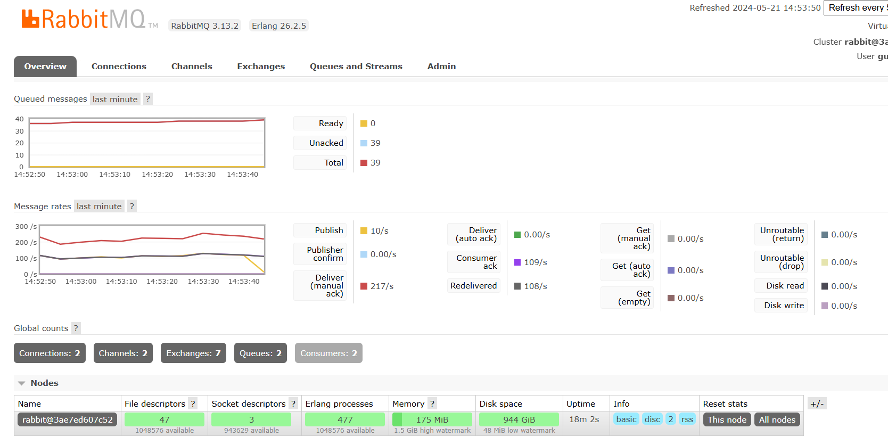

# Instrucciónes de instalación y uso

Instalación de docker y docker compose:

~~~
# Añadir al repositorio de linux la llave GPT de docker:
sudo apt-get update
sudo apt-get install ca-certificates curl
sudo install -m 0755 -d /etc/apt/keyrings
sudo curl -fsSL https://download.docker.com/linux/ubuntu/gpg -o /etc/apt/keyrings/docker.asc
sudo chmod a+r /etc/apt/keyrings/docker.asc

# Añadir al repositorio de APT:
echo \
  "deb [arch=$(dpkg --print-architecture) signed-by=/etc/apt/keyrings/docker.asc] https://download.docker.com/linux/ubuntu \
  $(. /etc/os-release && echo "$VERSION_CODENAME") stable" | \
  sudo tee /etc/apt/sources.list.d/docker.list > /dev/null
#Instalación:
sudo apt-get update
sudo apt-get install docker-ce docker-ce-cli containerd.io docker-buildx-plugin docker-compose-plugin
sudo apt-get install docker-compose-plugin
~~~

Clonar el repo:
~~~
git clone https://github.com/DanteFX/Implementacion-2.git
~~~
 

Ingresar al repo:
~~~
cd Implementacion-2 
~~~

Inicialización, descarga de contenedores y construcción:
~~~
docker compose up -d --build
~~~

Salir de la sesión:
~~~
exit
~~~

Apagar contenedor:
~~~
docker compose down
~~~

# Proyecto de Arquitectura de Software con Message Brokers

El proyecto demuestra la utilización de una arquitectura basada en Message Brokers que utiliza RabbitMQ para facilitar la comunicación entre microservicios. Los microservicios se desarrollan en Python y se utiliza Docker para gestionar los contenedores.

## Estructura del Proyecto

El proyecto está dividido en tres microservicios:

1. **Order Service**: Genera y envía pedidos a RabbitMQ.
2. **Inventory Service**: Valida los pedidos y publica los resultados.
3. **Shipping Service**: Gestiona el envío de pedidos validados.

### Muestra de funcionamiento

